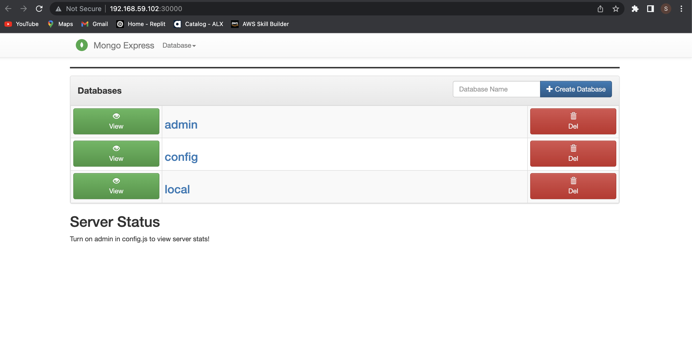

## demo-kubernetes setup - developing with kubernetes
This kubernetes configuration set up shows how to use config map, secrets, services and deployment in kubernetes using
  - nodejs backend with express module
  - mongodb for data storage
  - minikube to creates a VM on your local machine and deploys a simple cluster containing only one node
    - First we will be needing kubectl installed on our local machine, This can be downloaded via the link - [kubernetes](https://kubernetes.io/docs/tasks/tools/)
    - Download the minikube set-up via the link - [minikube](https://minikube.sigs.k8s.io/docs/start/)
    - Download 

  All container used are from docker images

#### To start the application
step 1: start the minikube to create kubernetes cluster  

    minikube start --driver=virtualbox

Step 2: start mongo-secret configuration to be used by both mongo and mongo-express

     kubectl apply -f mongo-secret.yaml

step 3: start mongo configuration

    kubectl apply -f mongo.yaml

step 4: start mongo configMap configuration ro be used by mongo-express

    kubectl apply -f mongo-configmap.yaml

step 5: start mongo-express configuration

    kubectl apply -f mongo-express.yaml

step 6: We can then get the external ip address open on our browser by using the command

    minikube service mongo-express-service

####  BONUS
In the mongo-secret.yaml file, we will notice that the mongo-root-username and mongo-root-password were encoded because it is a secret in base64 which is the defualt way to keep secret in kubernetes. This is done on the command line using:
    
    echo -n 'value-to-be-encoded' | base64
